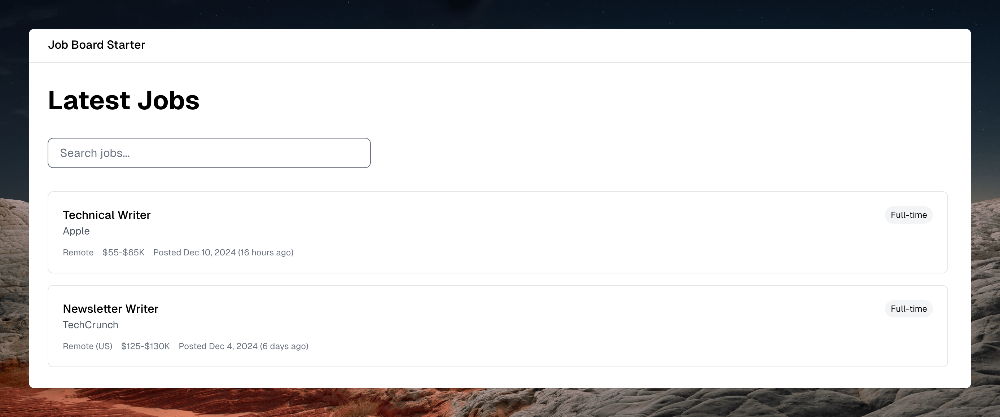

# Job Board Starter

A modern, minimal job board built with Next.js 15, Tailwind CSS, and Airtable. Features static generation, client-side search, and a clean UI with Geist font.



## Features

- Built with Next.js 15
- Styled with Tailwind CSS
- Airtable as the backend
- Client-side search
- Fully responsive
- Fast and SEO friendly
- Modern UI with Geist font, Tailwind CSS, and Shadcn UI
- Incremental Static Regeneration (ISR) for real-time updates

## Quick Start

1. Clone the repository:
```bash
git clone https://github.com/yourusername/jobboard-starter
cd jobboard-starter
npm install
```

2. Set up Airtable:
- Create a new base in Airtable
- Create a table named "Jobs" with these fields:
  ```
  title: Single line text
  company: Single line text
  location: Single line text
  type: Single select (Full-time, Part-time, Contract)
  salary_range: Single line text
  description: Long text
  apply_url: URL
  posted_date: Date
  status: Single select (active, inactive)
  ```
- Create a Personal Access Token at https://airtable.com/create/tokens
- Add these scopes to your token:
  - data.records:read
  - schema.bases:read
- Add your base to the token's access list

3. Environment Setup:
Create a `.env` file:
```env
AIRTABLE_ACCESS_TOKEN=your_token_here
AIRTABLE_BASE_ID=your_base_id_here
```

4. Development:
```bash
npm run dev
```

Visit `http://localhost:3000` to see your job board.

## Environment Variables

⚠️ IMPORTANT: Never commit your API keys or sensitive credentials to the repository!

Required environment variables:
- AIRTABLE_ACCESS_TOKEN=your_token_here
- AIRTABLE_BASE_ID=your_base_id_here

Create a `.env` file in your project root and add these variables there.

## Data Revalidation

The job board uses Next.js Incremental Static Regeneration (ISR) to keep data fresh:
- Pages automatically revalidate every 60 seconds
- New jobs appear without manual rebuilds
- Maintains fast static page delivery
- Zero downtime updates

You can adjust the revalidation interval in:
- `app/page.tsx` (job listing page)
- `app/jobs/[id]/page.tsx` (individual job pages)

## Project Structure

```
app/
  layout.tsx          # Root layout with Geist font
  page.tsx           # Home page with job listings
  jobs/
    [id]/
      page.tsx       # Individual job page
lib/
  db/
    airtable.ts     # Airtable integration
  utils/
    formatDate.ts   # Date formatting utilities
components/
  jobs/
    JobCard.tsx     # Job listing card
    JobSearch.tsx   # Search component
```

## Customization

### Styling
The project uses Tailwind CSS for styling. Main configuration files:
- `tailwind.config.ts`: Theme configuration
- `app/globals.css`: Global styles
- `components/*`: Individual component styles

### Data Source
Current implementation uses Airtable. To use a different data source:
1. Modify `lib/db/airtable.ts`
2. Implement the same interface for job data

## Deployment

1. Push to GitHub
2. Deploy on Vercel:
   - Connect your GitHub repository
   - Add environment variables
   - Deploy

## Contributing

Contributions are welcome! Please feel free to submit a Pull Request.

## License

MIT License - feel free to use this for your own job board!

## Support

If you find this helpful, please ⭐️ this repository!

## Credits

Built by [Tomas Laurinavicius](https://github.com/tomaslau)
